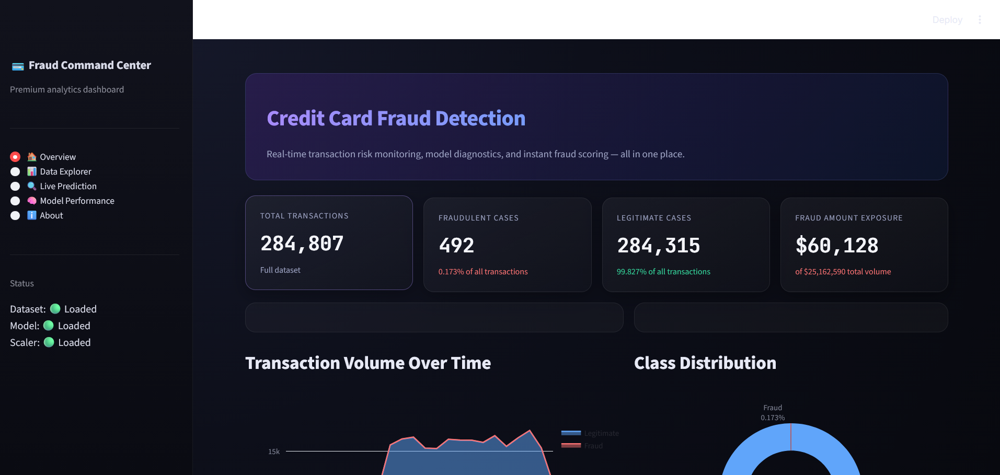
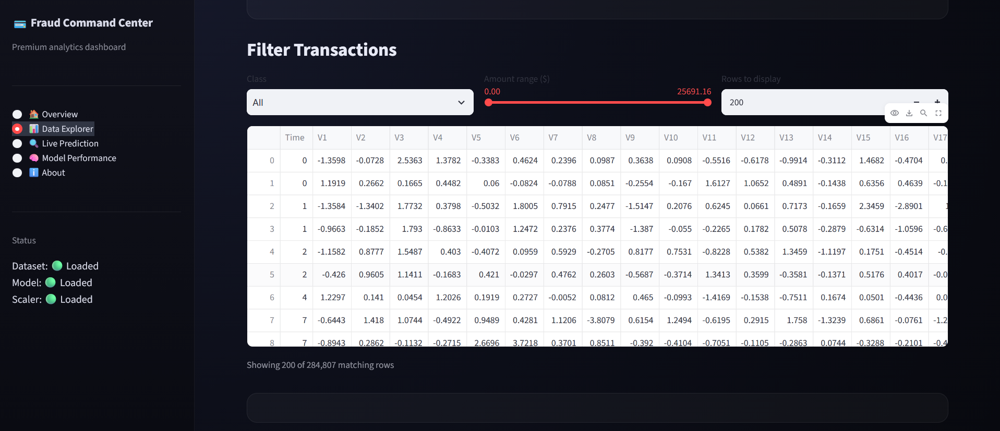
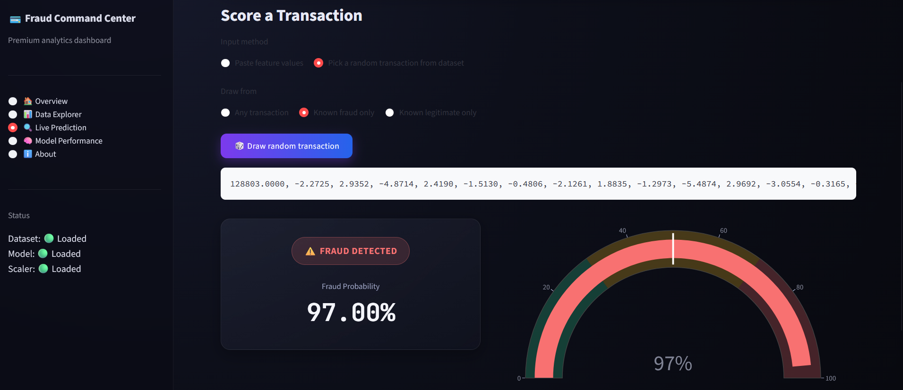
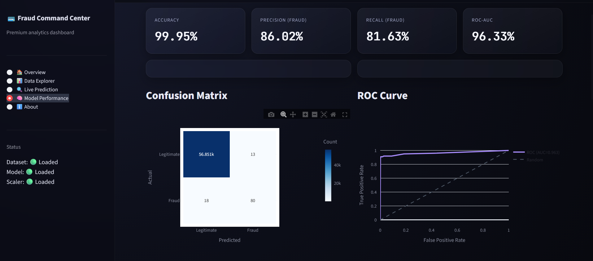

# 💳 AI-Powered Credit Card Fraud Detection


An AI-powered **Credit Card Fraud Detection system** built with Python, Flask, and Streamlit. The application uses **Machine Learning** to analyze transaction data and classify each transaction as **FRAUD** or **LEGITIMATE**, while providing a confidence (probability) score for the prediction.

---
## 📸 Screenshots

<table>
  <tr>
    <td width="50%"></td>
    <td width="50%"></td>
  </tr>
  <tr>
    <td width="50%"></td>
    <td width="50%"></td>
  </tr>
</table>


## ✨ Features

- 🤖 **AI Fraud Detection** — Classifies transactions as fraudulent or legitimate.
- 🧠 **ML-Based Classification** — Uses PCA-transformed transaction features (`Time`, `V1`–`V28`, `Amount`) with a calibrated Random Forest model.
- 📊 **Confidence Score** — Displays the model's fraud probability with a live gauge chart.
- ⚡ **Real-Time Prediction** — Score transactions instantly through the Streamlit dashboard or the Flask API.
- 🎨 **Premium Interactive Dashboard** — Dark glassmorphic UI with scroll-triggered blur/fade animations.
- ⚖️ **Class Imbalance Handling** — SMOTE oversampling + probability calibration for realistic fraud scores.
- 📈 **Model Diagnostics** — Confusion matrix, ROC curve, precision-recall curve, and feature importance visualizations.

---

## 🛠️ Tech Stack

| Technology | Purpose |
|---|---|
| **Python** | Core programming language |
| **Streamlit** | Interactive analytics dashboard |
| **Flask** | REST API for fraud prediction |
| **Scikit-learn** | Machine Learning, classification & calibration |
| **Imbalanced-learn (SMOTE)** | Handling extreme class imbalance |
| **Random Forest** | Fraud classification model |
| **Pandas / NumPy** | Data handling & numerical operations |
| **Plotly** | Interactive charts & visualizations |
| **Jupyter Notebook** | EDA, training & evaluation |

---

## 🧠 How It Works

The application follows a classic ML classification pipeline:

```text
Credit Card Transaction (Time, V1..V28, Amount)
       ↓
Feature Scaling (StandardScaler)
       ↓
SMOTE Oversampling (training only)
       ↓
Random Forest Classifier
       ↓
Probability Calibration (CalibratedClassifierCV)
       ↓
Fraud / Legitimate Prediction
       ↓
Confidence (Fraud Probability) Score
```

### Prediction Process

1. The user pastes transaction feature values or samples a real transaction from the dataset.
2. `Time` and `Amount` are scaled using the saved `StandardScaler`.
3. The trained, calibrated **Random Forest** model analyzes the 30 input features.
4. The model predicts whether the transaction is **FRAUD** or **LEGITIMATE**.
5. The application displays the prediction along with a fraud probability gauge.

---

## 🔍 Example

### Input

```text
0, -1.3598, -0.0728, 2.5363, 1.3782, -0.3383, 0.4624, 0.2396, 0.0987, 0.3638, 0.0908, -0.5516, -0.6178, -0.9914, -0.3112, 1.4682, -0.4704, 0.2080, 0.0258, 0.4040, 0.2514, -0.0183, 0.2778, -0.1105, 0.0669, 0.1285, -0.1891, 0.1336, -0.0211, 149.62
```

### Output

```text
Prediction: LEGITIMATE
Fraud Probability: 0.03%
```

The trained model analyzes the 30 input features and determines the most likely classification based on patterns learned from real transaction data.

---

## 📊 Machine Learning Model

The project uses the following approach:

### Feature Scaling

`Time` and `Amount` are scaled with **StandardScaler**, since the remaining `V1`–`V28` features are already PCA-transformed and normalized.

### SMOTE Oversampling

Fraud makes up only ~0.17% of transactions. **SMOTE (Synthetic Minority Oversampling)** is applied to the training set only, to help the model learn fraud patterns without being overwhelmed by legitimate transactions.

### Random Forest Classifier

A **Random Forest** ensemble model is trained to distinguish fraudulent from legitimate transactions.

### Probability Calibration

`CalibratedClassifierCV` is applied on top of the trained model to produce smoother, more realistic fraud probabilities instead of overconfident 0%/100% outputs.

---

## 🚀 Getting Started

### Prerequisites

Make sure you have the following installed:

- Python 3.9 or later
- Git
- A terminal or command prompt

### 1. Clone the Repository

```bash
git clone https://github.com/your-username/Credit-Card-Fraud-Detection.git
cd Credit-Card-Fraud-Detection
```

### 2. Create a Virtual Environment

#### Windows

```bash
python -m venv venv
venv\Scripts\activate
```

#### macOS / Linux

```bash
python3 -m venv venv
source venv/bin/activate
```

### 3. Install Dependencies

```bash
pip install -r requirements.txt
```

### 4. Add the Dataset

Download the [Credit Card Fraud Detection dataset](https://www.kaggle.com/mlg-ulb/creditcardfraud) from Kaggle and place it at:

```text
dataset/creditcard.csv
```

### 5. Train the Model

Run all cells in `notebooks/fraud_detection.ipynb` to preprocess the data, train the model, calibrate probabilities, and save `models/fraud_detection_model.pkl`.

### 6. Run the Application

#### Streamlit Dashboard (recommended)

```bash
streamlit run streamlit_app.py
```

The application will be available at:

```text
http://localhost:8501
```

#### Flask API

```bash
python app.py
```

The API will be available at:

```text
http://127.0.0.1:5000
```

---

## 📂 Project Structure

```text
Credit-Card-Fraud-Detection/
│
├── dataset/
│   └── creditcard.csv
│
├── notebooks/
│   └── fraud_detection.ipynb
│
├── models/
│   └── fraud_detection_model.pkl
│
├── app.py
├── streamlit_app.py
├── requirements.txt
├── run.bat
├── README.md
│
└── screenshots/
    ├── overview.png
    ├── live_prediction.png
    └── model_performance.png
```

---

## 🌐 Live Demo

🚀 **Try the deployed application:**

```text
https://your-app-name.streamlit.app/
```

---

## 🎯 Use Cases

This project can be used as a foundation for:

- Detecting fraudulent credit card transactions in real time
- Building risk-scoring systems for financial applications
- Demonstrating handling of extreme class imbalance in ML
- Learning practical Machine Learning deployment with Streamlit and Flask
- Exploring model calibration techniques for reliable probability scores

---

## 🔮 Future Improvements

- Add XGBoost / LightGBM model comparison.
- Deploy the API with authentication for production use.
- Add real-time transaction stream simulation.
- Add model explainability with SHAP values.
- Add downloadable fraud analysis reports.
- Add email/SMS alerts for high-risk transactions.

---

## 👨‍💻 Author

**Sriram Ponnaganti**

B.Tech — Computer Science Engineering (AI/ML)

---

## ⭐ Support

If you found this project useful, consider giving the repository a **star ⭐** on GitHub.
